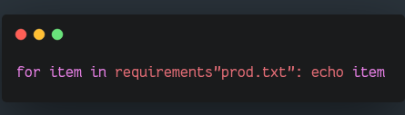

# RequirementsTxt

- Python [`requirements.txt`](https://pip.readthedocs.io/en/1.1/requirements.html#requirements-file-format) generic iterator parser for [Nim.](https://nim-lang.org)
- Python `RECORDS` file parser, is a custom header-less CSV file used by Python packages.
- *No Regex used in the making of this film!*




# Use

```nim
for it in requirements("requirements.txt"):  ## requirements is string
  echo it  ## (line: 1, editable: false, specifier: true, vcs: "git", protocol: "https", version: "1.6.0", name: "numpy", url: "", blanks: 1, nested: 0, private: 0, extras: @["full"])

for it in requirements(open("requirements.txt")): ## requirements is File
  echo it

for it in requirements(newStringStream(staticRead("requirements.txt"))): ## requirements is StringStream
  echo it
```

1 Input argument can be `filename: string | StringStream | File`. Based from the official spec: https://pip.readthedocs.io/en/1.1/requirements.html


### Output

Yields 1 `tuple` per parsed line:

* `line` Current line being parsed (`42`, etc).
* `editable` Boolean whether this requirement is *"editable"*.
* `specifier` Boolean whether a version specifier is used (`"flask>=1.5"` is `true`, `"flask"` is `false`)
* `vcs` Distributed version control system used (`"git"`, `"hg"`, etc).
* `protocol` Network protocol for transports (`"http"`, `"https"`, `"ssh"`, etc)
* `name` Package name parsed (`"pytest"`, etc).
* `version` Package version string (`"1.2.9"`, etc).
* `uri` URL if this requirement of `Uri` type (`"https://github.com/user/repo.git"`, etc).
* `extras` Sequence of strings with a list of extras (`"flask[extra1, extra2]"` is `@["extra1", "extra2"]`)
* `blanks` Current count of comments, blank lines, empty lines, etc (`42`, etc).
* `private` Current count of Private custom repositories (Not PYPI).
* `nested` Current count of recursively Nested requirements.txt files (`42`, etc).

If you need a `seq` of `tuple` use `sequtils.toSeq`.


# Install

```
nimble install requirementstxt
```


# Test

```console
$ nimble test

[Suite] Requirements.txt generic parser tests
  [OK] Big requirements.txt parsing
  [OK] Empty requirements.txt parsing
  [OK] Empty requirements.txt parsing 2
   Success: Execution finished
   Success: All tests passed

```

Test is using a [big and complex `requirements.txt`](https://github.com/juancarlospaco/nim-requirementstxt/blob/master/tests/requirements.txt).


# Documentation

- `runnableExamples` included.

```
nim doc requirementstxt.nim
```


# Requisites

- **None.**


# Dependencies

- **None.**


## Stars


[  ⬆️  ⬆️  ⬆️  ⬆️  ](#RequirementsTxt "Go to top")
